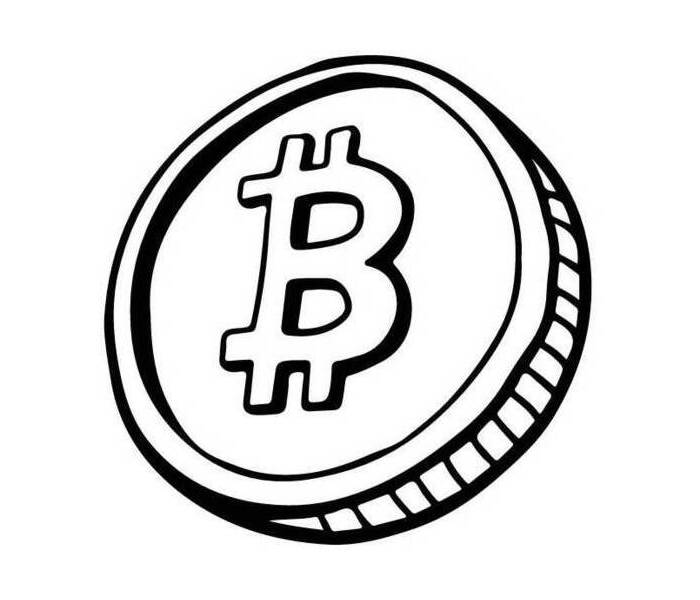

# Monetary Economics

  

TBA.

## Class Information

* [Fall 2024 Syllabus](/pdf/E3120syllabus.pdf)
* **Location:** Cook Hall 236
* **Time:** MWF 10:00am-11:50am
* **Office hours:** MW 2:00pm-3:00pm & by appointment
* **Discord:** [discord.gg/SsrNPEeP2P](https://discord.gg/SsrNPEeP2P)
* **TA:** [openai.com/blog/chatgpt](https://openai.com/blog/chatgpt)
* **Zoom:** [slu.zoom.us/my/econdojo](https://slu.zoom.us/my/econdojo)

## Conventional Money and Banking

* [Lecture 1: An Introduction to Money and Financial System](/pdf/lec1.pdf)
* [Lecture 2: Future Value, Present Value, and Interest Rates](/pdf/lec2.pdf)
* [Lecture 3: Understanding Risk](/pdf/lec3.pdf)
* [Lecture 4: Bonds, Bond Prices, and Determination of Interest Rates](/pdf/lec4.pdf)
* [Lecture 5: Risk and Term Structure of Interest Rates](/pdf/lec5.pdf)
* [Lecture 6: Stocks, Stock Markets, and Market Efficiency](/pdf/lec6.pdf)
* [Lecture 7: Foreign Exchange](/pdf/lec7.pdf)
* [Lecture 8: Central Bank Balance Sheet and Money Supply Process](/pdf/lec8.pdf)
* [Lecture 9: Monetary Policy: Stabilizing Domestic Economy](/pdf/lec9.pdf)
* [Lecture 10: Exchange-Rate Policy and Central Bank](/pdf/lec10.pdf)
* [Lecture 11: Money Growth, Money Demand, and Modern Monetary Policy](/pdf/lec11.pdf)
* [Lecture 12: A Simple Model of Money](/pdf/lec12.pdf)
* [Math Refresher](/pdf/app.pdf)

## Blockchain and Money

TBA.
